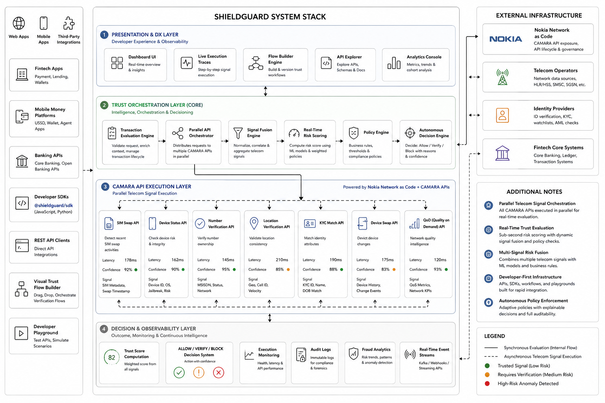
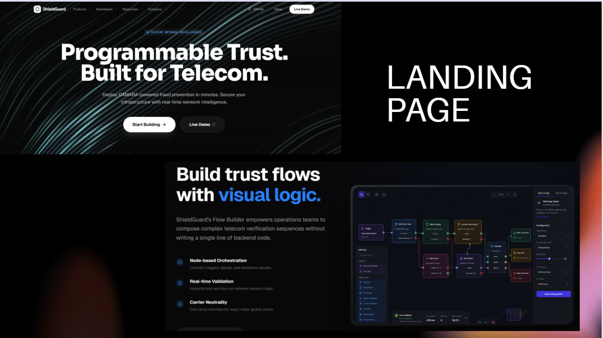
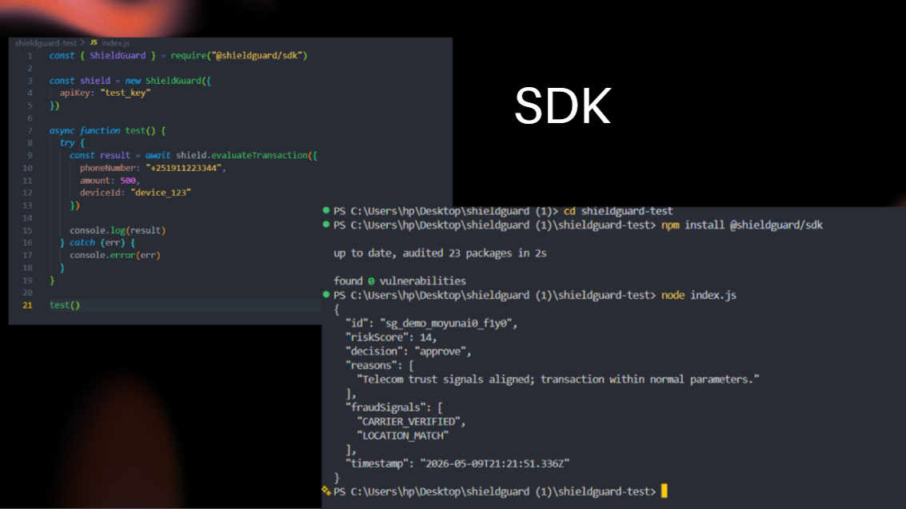

# ShieldGuard

**AI-powered telecom trust orchestration for mobile money, fintech, and digital services.**
ShieldGuard demonstrates how developers can use Open Gateway / CAMARA network signals to protect transactions, identity onboarding, and digital trust across Sub-Saharan Africa.



---

## Why ShieldGuard

ShieldGuard is built to showcase a modern, programmable trust layer that combines:

- **CAMARA/Open Gateway signal orchestration** for SIM Swap, Device Status, Number Verification, KYC Match, and Location Verification.
- **Real-time decisioning** with explainable outcomes (`approve`, `review`, `block`).
- **Developer-friendly UX** via a sandbox playground, analytics dashboard, and visual flow builder.
- **SSA-focused impact** for fintech, fraud prevention, SME onboarding, and mobile money security.

---

## Product highlights

| Feature | Description |
|---|---|
| **Developer Playground** | Craft evaluation payloads, run CAMARA-powered simulations, inspect explainable risk results and fraud signals. |
| **Flow Builder** | Build and deploy programmable telecom trust workflows with CAMARA API nodes. |
| **Analytics** | Visualize decision distribution, risk trends, latency, and network signal frequency. |
| **SDK** | Typed TypeScript client for integration, with demo/mock mode and retry support. |

---

## CAMARA API integration

ShieldGuard models a real-world Open Gateway architecture where multiple network APIs are combined for stronger trust decisions.

- **SIM Swap** — Detect unauthorized SIM changes and account takeover risk.
- **Device Status** — Verify whether a device is trusted, new, or suspicious.
- **Number Verification** — Confirm active subscriber identity for secure onboarding.
- **KYC Match** — Cross-check identity against customer records.
- **Location Verification** — Validate user location using telecom-derived context.

These signals are fused into a single evaluation so business logic can act on a normalized trust score with clear explainability.

---

## How it works

1. A user submits a transaction, mobile money transfer, or onboarding request.
2. ShieldGuard queries programmable CAMARA/Open Gateway signals in parallel.
3. The engine scores the request and returns a decision plus fraud signal evidence.
4. Analysts, operators, and downstream systems receive a transparent result for `approve`, `review`, or `block`.

---

## Demo visuals




---

## Getting started

### Install dependencies

```bash
npm install
```

### Run locally

```bash
npm run dev
```

### Build for production

```bash
npm run build
npm run preview
```

---

## Project structure

```text
├── apps/dashboard/        # React app and sandbox demo
│   ├── public/            # Static assets and demo images
│   └── src/               # Application source code
├── packages/sdk/          # ShieldGuard TypeScript SDK
├── packages/telecom-adapter/ # CAMARA / telecom signal abstraction
├── scripts/               # build helpers and tooling scripts
└── README.md              # Project overview and setup guide
```

---

## Deployment note

This monorepo uses a dashboard build located in `apps/dashboard/dist`. The root build command now copies the generated static assets into `dist/` so platforms like Vercel can deploy successfully.

---

## License

See the repository `LICENSE` file for details.
