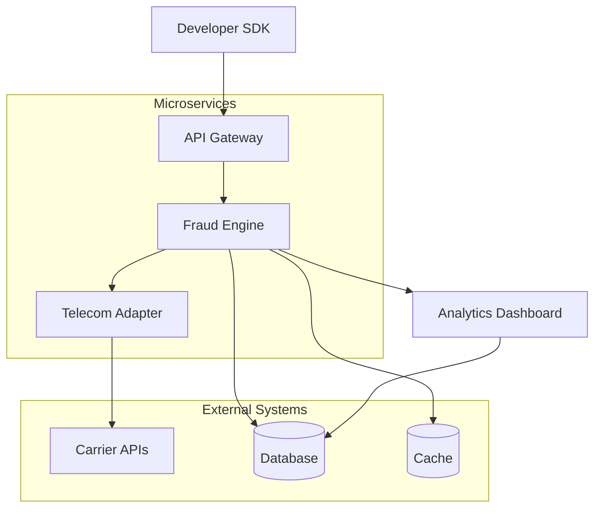

# 🏗️ ShieldGuard Architecture Overview

## Overview

ShieldGuard is a telecom-powered fraud intelligence infrastructure platform designed as a scalable, event-driven microservices architecture. The system processes real-time transaction data through a pipeline that integrates developer SDKs, API gateways, fraud detection engines, and telecom intelligence layers to deliver actionable risk scores.

## Core Architecture Components

### 1. Developer SDK Layer
- **Purpose**: Client-side integration for applications
- **Components**: TypeScript/JavaScript SDK, authentication handlers, transaction evaluators
- **Flow**: SDK captures transaction data → encrypts and sends to API Gateway

### 2. API Gateway Layer
- **Purpose**: Entry point for all API requests
- **Components**: Rate limiting, authentication, request routing, load balancing
- **Flow**: Validates API keys → routes to appropriate microservices

### 3. Fraud Detection Engine
- **Purpose**: Core risk scoring and anomaly detection
- **Components**: Scoring algorithms, signal processors, explainability layer
- **Flow**: Processes transaction data → generates risk scores (0-100)

### 4. Telecom Intelligence Layer
- **Purpose**: Integrates telecom signals for enhanced fraud detection
- **Components**: SIM swap detectors, device mappers, carrier adapters
- **Flow**: Queries telecom APIs → enriches transaction data with telecom signals

### 5. Analytics & Monitoring Layer
- **Purpose**: Provides insights and operational visibility
- **Components**: Dashboard, metrics collectors, alerting systems
- **Flow**: Aggregates logs and metrics → serves real-time analytics

## System Diagram

## Event-Driven Design

ShieldGuard employs an event-driven architecture using Apache Kafka for asynchronous processing:

- **Transaction Events**: SDK emits transaction events to Kafka topics
- **Signal Enrichment**: Telecom adapters consume events and enrich with signals
- **Scoring Pipeline**: Fraud engine processes enriched events through scoring pipeline
- **Response Events**: Risk scores published back to response topics

## Real-Time Processing Pipeline

1. **Ingestion**: Transaction data arrives via SDK/API
2. **Validation**: API Gateway validates and authenticates requests
3. **Enrichment**: Telecom signals added asynchronously
4. **Scoring**: Multi-signal risk calculation (latency < 100ms)
5. **Response**: Risk score returned with explainability data

## Microservices Breakdown

- **Auth Service**: JWT token management, API key validation
- **Scoring Service**: Risk algorithm execution, model updates
- **Telecom Service**: Carrier API orchestration, signal caching
- **Analytics Service**: Metric aggregation, dashboard data serving
- **Notification Service**: Alert delivery, webhook management

## Scalability Considerations

- Horizontal scaling via Kubernetes
- Database sharding for transaction history
- Redis caching for telecom signal lookups
- CDN integration for SDK distribution

## Security Architecture

- End-to-end encryption (TLS 1.3)
- API key rotation and scoping
- Audit logging for all transactions
- SOC 2 compliance framework

## Deployment Architecture

- Multi-region AWS deployment
- Blue-green deployments for zero-downtime updates
- Container orchestration with EKS
- Monitoring with Datadog and CloudWatch