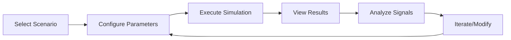

# 🎮 Developer Playground

## Overview

The ShieldGuard Developer Playground is an interactive simulation environment that allows developers to test fraud detection scenarios without affecting production systems. It provides realistic attack simulations, real-time feedback, and educational insights to accelerate integration and understanding.

## Purpose

The playground serves three primary functions:

1. **Integration Testing**: Validate SDK implementation with known fraud patterns
2. **Scenario Exploration**: Understand how different fraud signals impact risk scores
3. **Learning Tool**: Educate developers on fraud detection mechanics
4. **Debugging Aid**: Reproduce and analyze edge cases

## How Developers Simulate Attacks

### Playground Interface

The playground provides a web-based interface with:

- **Transaction Builder**: Drag-and-drop interface for crafting test transactions
- **Attack Scenario Library**: Pre-built fraud scenarios with explanations
- **Real-time Results**: Live risk scoring with signal breakdowns
- **Historical Replay**: Review past simulation results

### Simulation Workflow



## Sample Scenarios

### Scenario 1: SIM Swap Attack

**Description**: Simulates an account takeover attempt following a SIM swap fraud.

**Configuration**:
```json
{
  "scenario": "sim_swap_attack",
  "user_profile": {
    "user_id": "user_12345",
    "phone_number": "+15551234567",
    "normal_location": "New York, NY",
    "device_history": ["iPhone 12", "iPhone 13"]
  },
  "attack_vector": {
    "sim_swap_timing": "2_hours_ago",
    "transaction_location": "Los Angeles, CA",
    "device_fingerprint": "new_android_device",
    "amount": 2500.00
  }
}
```

**Expected Signals**:
- `sim_swap_detected` (+25 points)
- `location_anomaly` (+15 points)
- `device_mismatch` (+20 points)

**Sample Output**:
```json
{
  "simulation_id": "sim_abc123",
  "risk_score": 78,
  "risk_level": "high",
  "signals_triggered": [
    {
      "signal": "sim_swap_detected",
      "weight": 25,
      "description": "SIM swap detected on +15551234567 within last 24 hours",
      "confidence": 0.95
    },
    {
      "signal": "location_anomaly",
      "weight": 15,
      "description": "Transaction 2400 miles from user's normal location",
      "confidence": 0.88
    },
    {
      "signal": "device_mismatch",
      "weight": 20,
      "description": "Device fingerprint doesn't match user's device history",
      "confidence": 0.92
    }
  ],
  "explanation": "High-risk transaction due to recent SIM swap and device/location anomalies. Recommend additional authentication.",
  "processing_time_ms": 45
}
```

### Scenario 2: High-Value Transaction Fraud

**Description**: Tests velocity and amount anomaly detection for large transactions.

**Configuration**:
```json
{
  "scenario": "high_value_fraud",
  "user_history": {
    "average_transaction": 45.67,
    "max_transaction": 299.99,
    "transactions_last_30_days": 23
  },
  "fraud_attempt": {
    "amount": 15000.00,
    "time_since_last_transaction": "5_minutes",
    "merchant_category": "luxury_goods",
    "payment_method": "new_card"
  }
}
```

**Expected Signals**:
- `amount_anomaly` (+15 points)
- `high_velocity` (+10 points)
- `merchant_risk` (+5 points)

### Scenario 3: New Device Login Anomaly

**Description**: Simulates first-time login from an unrecognized device.

**Configuration**:
```json
{
  "scenario": "new_device_login",
  "user_profile": {
    "login_history": [
      {"device": "iPhone 13", "location": "home", "frequency": "daily"},
      {"device": "MacBook Pro", "location": "office", "frequency": "weekdays"}
    ]
  },
  "suspicious_login": {
    "device_type": "unknown_android",
    "location": "foreign_country",
    "time": "3_am_local",
    "ip_vpn_detected": true
  }
}
```

**Expected Signals**:
- `device_mismatch` (+20 points)
- `location_anomaly` (+15 points)
- `unusual_timing` (+5 points)
- `suspicious_network` (+5 points)

## UI Flow Explanation

### 1. Scenario Selection
- **Library View**: Grid of pre-built scenarios with difficulty ratings
- **Custom Builder**: Step-by-step transaction construction
- **Import/Export**: Save and share simulation configurations

### 2. Parameter Configuration
- **Visual Editors**: Sliders, dropdowns, and maps for input
- **Validation**: Real-time feedback on parameter combinations
- **Templates**: Quick-start configurations for common use cases

### 3. Execution & Results
- **Live Processing**: Real-time progress indicators
- **Signal Breakdown**: Expandable details for each triggered signal
- **Comparison Mode**: Side-by-side results for different configurations

### 4. Analysis Tools
- **Signal Explorer**: Deep-dive into individual fraud signals
- **Historical Trends**: Track how changes affect risk scores
- **Export Reports**: Generate PDF/HTML reports for documentation

## Advanced Features

### Custom Signal Injection

```typescript
// Inject custom signals for testing
const simulation = await playground.simulateTransaction(transactionData, {
  customSignals: [
    {
      name: 'internal_fraud_flag',
      weight: 10,
      description: 'Internal risk scoring system flag'
    }
  ]
});
```

### Batch Simulations

```typescript
// Run multiple scenarios in parallel
const scenarios = [
  { name: 'normal_transaction', config: normalConfig },
  { name: 'sim_swap_attack', config: simSwapConfig },
  { name: 'velocity_attack', config: velocityConfig }
];

const results = await playground.runBatchSimulations(scenarios);
```

### API Integration Testing

```typescript
// Test actual SDK integration
const sdkResult = await shieldGuard.evaluateTransaction(testTransaction);
const playgroundResult = await playground.simulateTransaction(testTransaction);

// Compare results
const comparison = playground.compareResults(sdkResult, playgroundResult);
```

## Sample JSON Outputs

### Full Simulation Response

```json
{
  "simulation": {
    "id": "sim_xyz789",
    "timestamp": "2024-01-15T10:30:00Z",
    "scenario": "sim_swap_attack",
    "execution_time_ms": 67
  },
  "transaction": {
    "amount": 2500.00,
    "currency": "USD",
    "user_id": "user_12345",
    "device_id": "device_unknown",
    "ip_address": "203.0.113.1",
    "phone_number": "+15551234567"
  },
  "results": {
    "risk_score": 78,
    "risk_level": "high",
    "signals": [
      {
        "name": "sim_swap_detected",
        "category": "telecom",
        "weight": 25,
        "confidence": 0.95,
        "description": "SIM swap detected within 24 hours",
        "metadata": {
          "swap_timestamp": "2024-01-15T08:15:00Z",
          "carrier": "Verizon"
        }
      },
      {
        "name": "location_anomaly",
        "category": "behavioral",
        "weight": 15,
        "confidence": 0.88,
        "description": "Transaction location differs significantly from user history",
        "metadata": {
          "distance_km": 2400,
          "normal_location": "New York, NY"
        }
      }
    ],
    "explanation": "Transaction exhibits multiple high-risk indicators including recent SIM swap and geographic anomalies.",
    "recommendations": [
      "Require additional authentication",
      "Contact user to verify transaction",
      "Monitor account for 24 hours"
    ]
  },
  "metadata": {
    "model_version": "v2.1.3",
    "processing_pipeline": ["validation", "enrichment", "scoring"],
    "cache_hits": 2,
    "external_calls": 1
  }
}
```

## Why It Improves Developer Adoption

### 1. **Reduced Time-to-Integration**
- **Immediate Feedback**: Test integrations without production data
- **Error Isolation**: Debug issues in controlled environment
- **Confidence Building**: Validate understanding before going live

### 2. **Educational Value**
- **Signal Transparency**: Understand what triggers risk scores
- **Scenario-Based Learning**: Learn through realistic examples
- **Best Practices**: Discover optimal integration patterns

### 3. **Risk Mitigation**
- **Pre-Production Testing**: Catch integration issues early
- **Load Testing**: Simulate high-volume scenarios
- **Edge Case Discovery**: Find and handle unusual conditions

### 4. **Developer Experience**
- **Interactive Learning**: Hands-on exploration of fraud detection
- **API Familiarity**: Practice with real SDK methods
- **Documentation Integration**: Live examples complement docs

## Integration with Development Workflow

### CI/CD Pipeline Integration

```yaml
# .github/workflows/test-fraud-integration.yml
name: Fraud Integration Tests
on: [push, pull_request]

jobs:
  test-fraud-scenarios:
    runs-on: ubuntu-latest
    steps:
      - uses: actions/checkout@v3
      - name: Setup Node.js
        uses: actions/setup-node@v3
        with:
          node-version: '18'
      - name: Install dependencies
        run: npm ci
      - name: Run fraud simulations
        run: npm run test:fraud-playground
        env:
          SHIELDGUARD_API_KEY: ${{ secrets.SHIELDGUARD_API_KEY }}
```

### Local Development Setup

```bash
# Clone playground locally
git clone https://github.com/shieldguard/playground.git
cd playground

# Install dependencies
npm install

# Start development server
npm run dev

# Run simulations
npm run simulate -- --scenario sim_swap_attack
```

## Metrics & Analytics

The playground tracks usage metrics to improve the developer experience:

- **Popular Scenarios**: Most-used simulation types
- **Success Rates**: Percentage of successful integrations
- **Common Issues**: Frequently encountered problems
- **Time to Integration**: Average time from signup to first production use