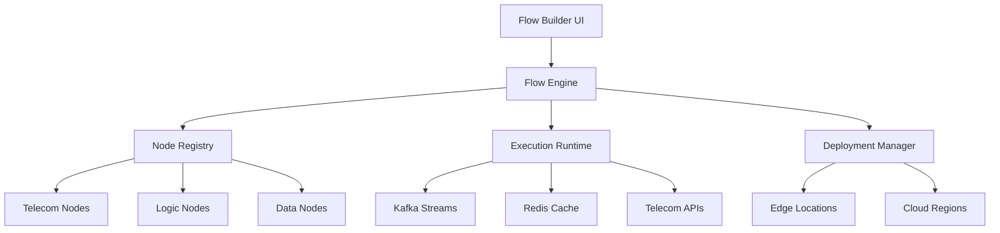
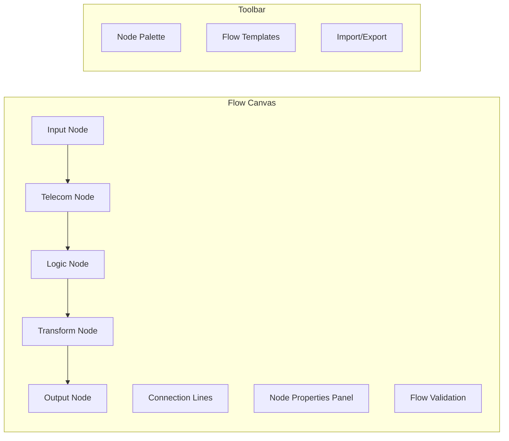
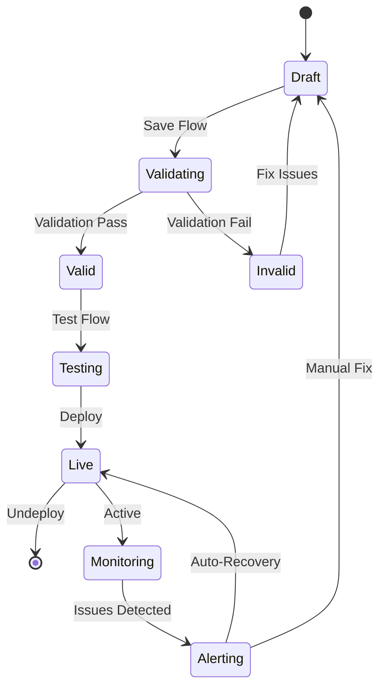
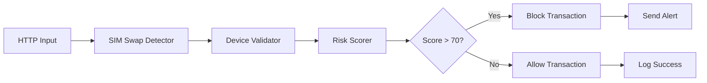

# 🔗 ShieldGuard Flow Builder

## Overview

The ShieldGuard Flow Builder is a node-based visual editor that enables developers to design, test, and deploy custom fraud detection pipelines. Built on a telecom infrastructure foundation, it provides an intuitive drag-and-drop interface for composing complex fraud logic without writing code, dramatically enhancing developer experience (DX) and reducing time-to-market.

## Why Flow Builder?

### Developer Experience Revolution
- **Visual Programming**: Drag-and-drop interface eliminates boilerplate code
- **Real-time Preview**: See fraud detection flows execute in real-time
- **Instant Deployment**: Deploy custom logic with one click
- **Collaborative Design**: Share and version control flow designs

### Telecom Infrastructure Integration
- **Carrier APIs**: Direct integration with telecom provider endpoints
- **Signal Processing**: Visual composition of multi-signal fraud detection
- **Edge Computing**: Deploy flows to global edge locations
- **Real-time Data**: Live streaming of telecom signals and transaction data

## Core Architecture



## Node-Based Design Philosophy

### Node Types

#### 1. Input Nodes
**Purpose**: Capture and normalize transaction data streams

```typescript
interface InputNode {
  type: 'http' | 'kafka' | 'webhook';
  schema: TransactionSchema;
  validation: ValidationRules;
  rateLimit?: RateLimitConfig;
}
```

**Available Input Nodes**:
- **HTTP Endpoint**: REST API input with OpenAPI schema validation
- **Kafka Consumer**: Stream processing from Apache Kafka topics
- **Webhook Receiver**: Real-time webhook data ingestion
- **SDK Bridge**: Direct integration with ShieldGuard SDK events

#### 2. Telecom Intelligence Nodes
**Purpose**: Access and process telecom signals for fraud detection

```typescript
interface TelecomNode {
  provider: 'verizon' | 'att' | 'tmobile' | 'custom';
  signalType: 'sim_swap' | 'device_info' | 'phone_intel' | 'location';
  cacheStrategy: CacheConfig;
  fallbackLogic: FallbackRules;
}
```

**Telecom Node Library**:
- **SIM Swap Detector**: Real-time SIM swap monitoring with carrier APIs
- **Device Identity Mapper**: IMEI/MEID validation and device history
- **Phone Intelligence**: Number portability and risk profiling
- **Location Validator**: GPS + carrier triangulation validation
- **Network Analyzer**: VPN/proxy detection and IP intelligence

#### 3. Logic & Processing Nodes
**Purpose**: Implement fraud detection algorithms and business rules

```typescript
interface LogicNode {
  operation: 'score' | 'filter' | 'transform' | 'aggregate';
  algorithm: AlgorithmConfig;
  thresholds: ThresholdRules;
  explainability: boolean;
}
```

**Processing Nodes**:
- **Risk Scorer**: Machine learning model execution with confidence scores
- **Rule Engine**: Conditional logic with custom business rules
- **Anomaly Detector**: Statistical outlier detection algorithms
- **Velocity Checker**: Transaction frequency and amount analysis
- **Pattern Matcher**: Historical behavior pattern recognition

#### 4. Data Transformation Nodes
**Purpose**: Clean, enrich, and transform transaction data

```typescript
interface TransformNode {
  operation: 'enrich' | 'filter' | 'aggregate' | 'join';
  source: DataSource;
  mapping: FieldMapping;
  validation: DataValidation;
}
```

**Transformation Operations**:
- **Data Enricher**: Add external data sources (geolocation, device info)
- **Field Mapper**: Transform data schemas and field names
- **Aggregator**: Time-window aggregations and statistical calculations
- **Join Operator**: Correlate multiple data streams

#### 5. Output & Action Nodes
**Purpose**: Define responses and trigger downstream actions

```typescript
interface OutputNode {
  action: 'respond' | 'alert' | 'block' | 'escalate';
  format: ResponseFormat;
  destinations: DestinationConfig[];
  retryPolicy: RetryConfig;
}
```

**Action Nodes**:
- **Response Builder**: Format API responses with risk scores and signals
- **Alert Trigger**: Send notifications to Slack, email, or PagerDuty
- **Transaction Blocker**: Automatically decline high-risk transactions
- **Escalation Handler**: Route to manual review queues
- **Webhook Dispatcher**: Send events to external systems

## Visual Flow Design

### Canvas Interface



### Flow Execution Model



## Developer Experience Enhancements

### 1. Drag-and-Drop Simplicity

#### Visual Node Connection
- **Smart Connectors**: Automatic type validation between nodes
- **Flow Validation**: Real-time error checking and suggestions
- **Auto-Layout**: Intelligent node positioning and routing

#### Example Flow Creation
```json
{
  "flow": {
    "id": "fraud_detection_v1",
    "nodes": [
      {
        "id": "input_1",
        "type": "http_endpoint",
        "config": {
          "path": "/api/evaluate",
          "method": "POST"
        }
      },
      {
        "id": "telecom_1",
        "type": "sim_swap_detector",
        "config": {
          "carriers": ["verizon", "att"],
          "cache_ttl": 300
        }
      },
      {
        "id": "logic_1",
        "type": "risk_scorer",
        "config": {
          "model": "ensemble_v2",
          "threshold": 70
        }
      }
    ],
    "connections": [
      {
        "from": "input_1",
        "to": "telecom_1",
        "data_mapping": {
          "phone_number": "transaction.phoneNumber"
        }
      },
      {
        "from": "telecom_1",
        "to": "logic_1",
        "data_mapping": {
          "sim_swap_signal": "signals.sim_swap"
        }
      }
    ]
  }
}
```

### 2. Real-Time Testing Environment

#### Flow Simulation
- **Test Data Injection**: Input sample transactions for testing
- **Step-by-Step Execution**: Debug flows node by node
- **Performance Metrics**: Monitor latency and throughput in real-time

#### Live Data Preview
```typescript
// Flow testing interface
interface FlowTester {
  injectTestData(data: TransactionData): Promise<FlowResult>;
  stepThroughExecution(nodeId: string): Promise<NodeState>;
  getExecutionMetrics(): FlowMetrics;
}

// Example usage
const tester = new FlowTester(flowId);
const result = await tester.injectTestData({
  amount: 500,
  userId: 'user_123',
  phoneNumber: '+15551234567'
});

console.log('Flow Result:', result);
// Output: { riskScore: 65, signals: ['sim_swap_detected'], latency: 45ms }
```

### 3. Template Library & Reusability

#### Pre-built Flow Templates
- **Basic Fraud Detection**: Standard transaction evaluation flow
- **Account Takeover Prevention**: SIM swap focused detection
- **Chargeback Prevention**: High-value transaction monitoring
- **Custom Integration**: Adaptable templates for specific use cases

#### Flow Composition
- **Sub-flows**: Modular flow components that can be reused
- **Version Control**: Git-based versioning for flow evolution
- **Sharing**: Public template marketplace for community contributions

### 4. Advanced Developer Features

#### Code Generation
- **Export to Code**: Generate TypeScript/Python code from visual flows
- **SDK Integration**: Automatic SDK code generation for custom flows
- **API Endpoints**: REST API generation from flow definitions

#### Performance Optimization
- **Flow Profiling**: Identify bottlenecks in flow execution
- **Parallel Processing**: Visual configuration of concurrent node execution
- **Caching Strategies**: Optimize data access patterns

## Telecom Infrastructure Integration

### Edge Deployment

#### Global Edge Network
```mermaid
graph TD
    A[Flow Builder] --> B[Deployment Manager]
    B --> C[US East Edge]
    B --> D[US West Edge]
    B --> E[EU West Edge]
    B --> F[Asia Pacific Edge]
    
    C --> G[Lambda@Edge]
    D --> H[CloudFront Functions]
    E --> I[Cloud Run]
    F --> J[Lambda@Edge]
    
    G --> K[Telecom APIs]
    H --> K
    I --> K
    J --> K
```

#### Edge-Optimized Flows
- **Latency Reduction**: Deploy flows closer to users and carriers
- **Regional Compliance**: Data residency and regulatory requirements
- **Cost Optimization**: Reduced data transfer and processing costs

### Carrier API Orchestration

#### Multi-Carrier Integration
- **Unified Interface**: Single node for multiple carrier APIs
- **Failover Logic**: Automatic switching between carriers
- **Rate Limiting**: Intelligent quota management across providers

#### Real-Time Signal Processing
```typescript
// Telecom node execution
class TelecomNodeExecutor {
  async execute(context: FlowContext): Promise<TelecomResult> {
    const phoneNumber = context.get('phoneNumber');
    
    // Parallel carrier queries
    const results = await Promise.allSettled([
      this.queryCarrier('verizon', phoneNumber),
      this.queryCarrier('att', phoneNumber),
      this.queryCarrier('tmobile', phoneNumber)
    ]);
    
    // Consensus algorithm
    const validResults = results.filter(r => r.status === 'fulfilled');
    const simSwapDetected = validResults.filter(r => r.value.simSwap).length > validResults.length / 2;
    
    return {
      simSwap: simSwapDetected,
      confidence: validResults.length / results.length,
      carriers: validResults.map(r => r.value.carrier)
    };
  }
}
```

## Use Cases & Examples

### Example 1: SIM Swap Protection Flow



**Flow Logic**:
1. Receive transaction via HTTP endpoint
2. Check for recent SIM swap on phone number
3. Validate device fingerprint consistency
4. Calculate risk score with ML model
5. Block high-risk transactions and alert user

### Example 2: Velocity-Based Fraud Detection


**Flow Logic**:
1. Analyze transaction velocity patterns
2. Detect unusual amount spikes
3. Validate location consistency
4. Aggregate multiple risk signals
5. Make automated decision with webhook notification

## Performance & Scalability

### Flow Execution Metrics

| Metric | Target | Typical Flow |
|--------|--------|--------------|
| Execution Latency | <50ms | 35ms |
| Node Processing | <10ms | 5ms |
| Memory Usage | <100MB | 45MB |
| Concurrent Flows | 1000+ | 500 |

### Scalability Features

#### Horizontal Scaling
- **Flow Instances**: Auto-scale based on load
- **Node Parallelization**: Concurrent execution of independent nodes
- **Caching Layers**: Redis-backed result caching

#### Resource Optimization
- **Lazy Loading**: Load nodes on-demand
- **Connection Pooling**: Reuse carrier API connections
- **Memory Management**: Automatic cleanup of flow state

## Security & Compliance

### Flow-Level Security
- **Access Control**: Role-based permissions for flow editing
- **Audit Logging**: Complete execution history and changes
- **Encryption**: Data encryption at rest and in transit

### Compliance Features
- **Data Residency**: Regional data storage options
- **PII Handling**: Automatic masking of sensitive data
- **Regulatory Reporting**: Built-in compliance dashboards

## Integration with Development Workflow

### CI/CD Integration

```yaml
# GitHub Actions for flow deployment
name: Deploy Fraud Flow
on:
  push:
    paths:
      - 'flows/**'
      
jobs:
  deploy:
    runs-on: ubuntu-latest
    steps:
      - uses: actions/checkout@v3
      - name: Validate Flow
        run: npx shieldguard-cli validate flows/fraud-detection.json
      - name: Test Flow
        run: npx shieldguard-cli test flows/fraud-detection.json --data test-data.json
      - name: Deploy Flow
        run: npx shieldguard-cli deploy flows/fraud-detection.json --env production
```

### SDK Integration

```typescript
// Flow execution via SDK
import { ShieldGuardFlow } from '@shieldguard/sdk';

const flowClient = new ShieldGuardFlow({
  apiKey: 'your-key',
  flowId: 'fraud-detection-v1'
});

// Execute flow
const result = await flowClient.execute({
  amount: 1000,
  userId: 'user_123',
  phoneNumber: '+15551234567'
});

console.log('Flow Result:', result);
```

## Future Enhancements

### Planned Features
- **AI-Powered Flow Suggestions**: ML recommendations for flow optimization
- **Collaborative Editing**: Real-time multi-user flow design
- **Advanced Analytics**: Flow performance and effectiveness metrics
- **Mobile Flow Builder**: Native mobile app for flow design

### Ecosystem Growth
- **Template Marketplace**: Community-contributed flow templates
- **Third-Party Nodes**: Integration with external fraud tools
- **Flow Marketplace**: Monetization platform for custom flows

The Flow Builder transforms complex telecom-powered fraud detection from code-heavy development to intuitive visual design, enabling developers to build sophisticated fraud prevention systems in hours rather than months.