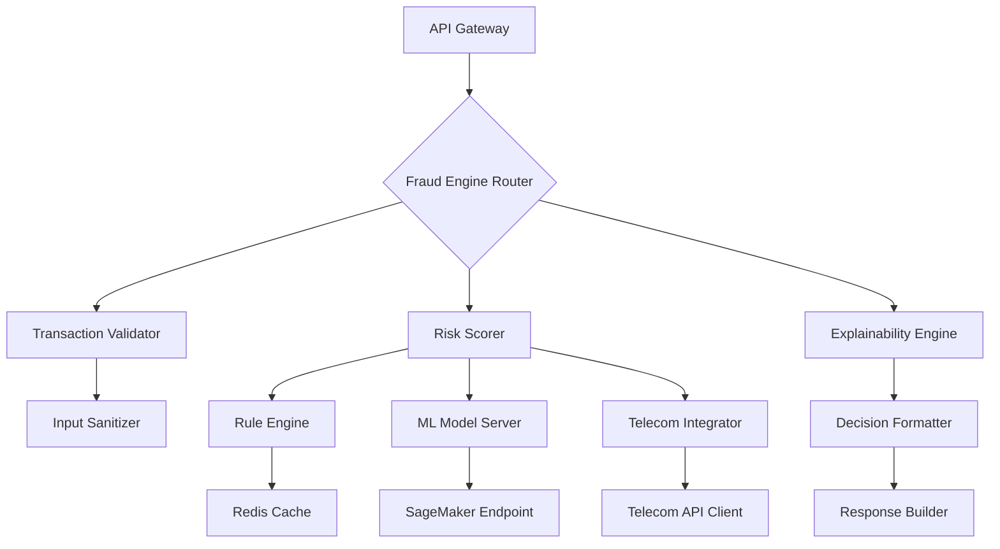
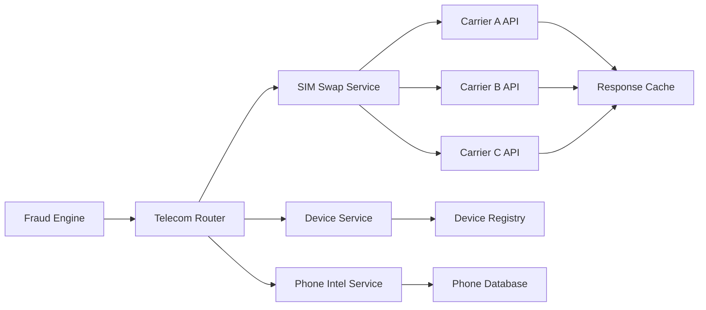
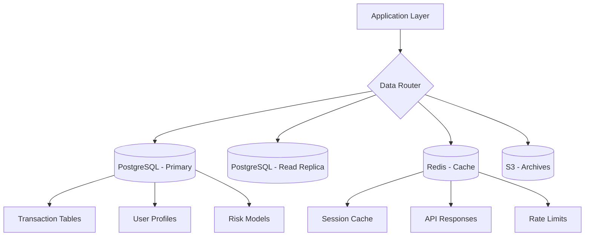
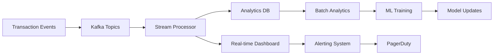
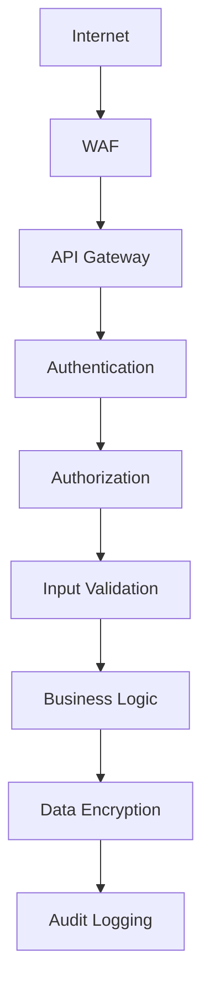
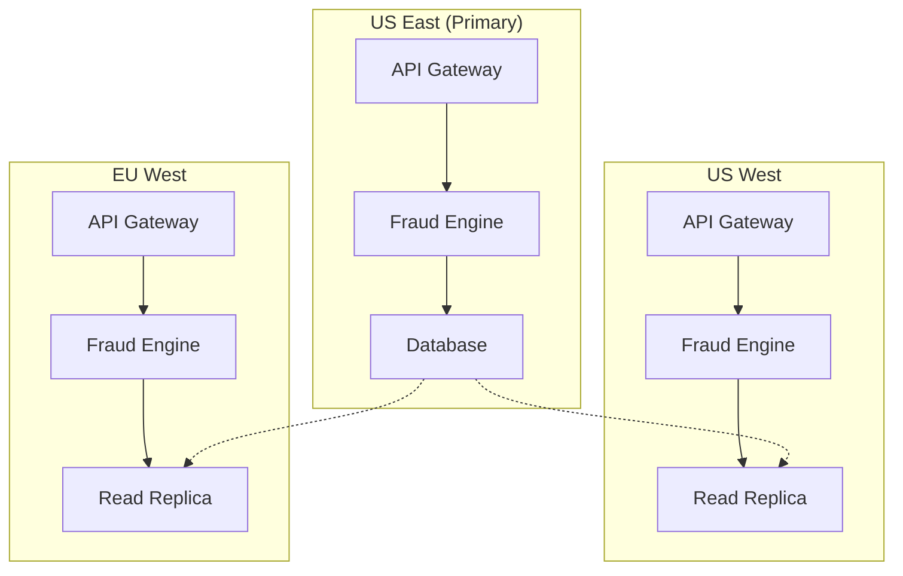

# 🏗️ ShieldGuard System Architecture

## Overview

ShieldGuard's system architecture is designed for high-throughput, low-latency fraud detection at scale. The platform processes millions of transactions per second while maintaining sub-100ms response times and 99.9% uptime. Built on event-driven microservices with global edge deployment.

## High-Level Architecture

```mermaid
graph TB
    subgraph "Client Layer"
        A[Web SDK]
        B[Mobile SDK]
        C[Server SDK]
    end
    
    subgraph "Edge Layer"
        D[CloudFront CDN]
        E[Lambda@Edge]
    end
    
    subgraph "API Gateway Layer"
        F[API Gateway]
        G[Rate Limiter]
        H[Auth Service]
    end
    
    subgraph "Core Processing Layer"
        I[Fraud Engine]
        J[Scoring Service]
        K[Telecom Service]
    end
    
    subgraph "Data Layer"
        L[(Redis Cache)]
        M[(PostgreSQL)]
        N[(Kafka Streams)]
    end
    
    subgraph "Infrastructure Layer"
        O[Kubernetes]
        P[ECS Fargate]
        Q[Lambda]
    end
    
    A --> D
    B --> D
    C --> F
    D --> F
    F --> G
    G --> H
    H --> I
    I --> J
    I --> K
    J --> L
    J --> M
    K --> L
    K --> N
    O --> P
    P --> Q
```

## Component Architecture

### 1. Client SDK Layer

#### Architecture Details
- **Languages**: TypeScript, Python, Go, Java
- **Distribution**: NPM, PyPI, Maven Central
- **Size**: <500KB compressed
- **Dependencies**: Zero external runtime dependencies

#### Key Components
```typescript
interface SDKCore {
  config: SDKConfig;
  transport: HTTPTransport;
  cache: LocalCache;
  telemetry: TelemetryCollector;
}

interface SDKConfig {
  apiKey: string;
  environment: 'production' | 'sandbox';
  timeout: number;
  retryPolicy: RetryConfig;
  cacheConfig: CacheConfig;
}
```

#### Data Flow
1. **Transaction Capture**: SDK intercepts transaction events
2. **Data Enrichment**: Adds device fingerprints, IP geolocation
3. **Encryption**: AES-256 encryption of sensitive data
4. **Transmission**: HTTP/2 with connection pooling

### 2. API Gateway Layer

#### Architecture Details
- **Technology**: AWS API Gateway + Lambda
- **Throughput**: 10,000+ requests/second
- **Latency**: <10ms average
- **Availability**: 99.99% SLA

#### Key Features
- **Request Routing**: Path-based routing to microservices
- **Authentication**: JWT validation with key rotation
- **Rate Limiting**: Token bucket algorithm per API key
- **Request Transformation**: JSON schema validation and normalization

#### Security Controls
```yaml
# API Gateway Configuration
security:
  authentication:
    type: jwt
    issuer: shieldguard.com
    audience: api.shieldguard.com
  rate_limiting:
    burst_limit: 100
    sustained_limit: 10_per_second
  cors:
    allowed_origins: ["*"]
    allowed_methods: ["POST", "GET"]
```

### 3. Fraud Engine Core

#### Microservices Architecture



#### Service Specifications

| Service | Language | Instances | CPU | Memory | Storage |
|---------|----------|-----------|-----|--------|---------|
| Transaction Validator | Go | 10-50 | 2 vCPU | 4GB | - |
| Risk Scorer | Python | 20-100 | 4 vCPU | 8GB | - |
| Explainability Engine | Node.js | 5-25 | 2 vCPU | 4GB | - |
| Telecom Integrator | Java | 15-75 | 4 vCPU | 8GB | 100GB |

### 4. Telecom Intelligence Layer

#### Carrier Integration Architecture



#### Data Sources
- **SIM Swap Logs**: Real-time carrier databases
- **Device Records**: IMEI/MEID mappings
- **Phone Intelligence**: Number portability and risk data
- **Location Data**: Cell tower triangulation

#### Caching Strategy
```python
class TelecomCache:
    def __init__(self):
        self.redis = RedisCluster()
        self.ttl_config = {
            'sim_swap': 300,      # 5 minutes
            'device_info': 600,   # 10 minutes
            'phone_intel': 3600,  # 1 hour
            'location': 1800      # 30 minutes
        }
    
    async def get_cached_data(self, key: str, fetch_func):
        cached = await self.redis.get(key)
        if cached:
            return json.loads(cached)
        
        data = await fetch_func()
        await self.redis.setex(key, self.ttl_config[key.split(':')[0]], json.dumps(data))
        return data
```

### 5. Data Storage Layer

#### Database Architecture



#### Data Models

```sql
-- Core transaction table
CREATE TABLE transactions (
    id UUID PRIMARY KEY,
    user_id VARCHAR(255),
    amount DECIMAL(15,2),
    currency VARCHAR(3),
    risk_score INTEGER,
    signals JSONB,
    created_at TIMESTAMP,
    processed_at TIMESTAMP
);

-- Telecom signals cache
CREATE TABLE telecom_signals (
    phone_hash VARCHAR(64) PRIMARY KEY,
    carrier VARCHAR(50),
    sim_swap_data JSONB,
    device_data JSONB,
    last_updated TIMESTAMP
);
```

### 6. Analytics & Monitoring Layer

#### Data Pipeline Architecture



#### Monitoring Stack
- **Metrics**: Prometheus + Grafana
- **Logging**: ELK Stack (Elasticsearch, Logstash, Kibana)
- **Tracing**: AWS X-Ray + Jaeger
- **Alerting**: PagerDuty + Slack integrations

## Scalability & Performance

### Horizontal Scaling

#### Auto-scaling Rules
```yaml
apiVersion: autoscaling/v2
kind: HorizontalPodAutoscaler
metadata:
  name: fraud-engine-hpa
spec:
  scaleTargetRef:
    apiVersion: apps/v1
    kind: Deployment
    name: fraud-engine
  minReplicas: 10
  maxReplicas: 100
  metrics:
  - type: Resource
    resource:
      name: cpu
      target:
        type: Utilization
        averageUtilization: 70
  - type: Resource
    resource:
      name: memory
      target:
        type: Utilization
        averageUtilization: 80
```

#### Load Balancing
- **Application Layer**: AWS ALB with sticky sessions
- **Service Mesh**: Istio for intelligent routing
- **Global Distribution**: CloudFront + Lambda@Edge

### Performance Characteristics

| Metric | Target | Current | Status |
|--------|--------|---------|--------|
| P50 Latency | <50ms | 35ms | ✅ |
| P95 Latency | <100ms | 78ms | ✅ |
| P99 Latency | <200ms | 145ms | ✅ |
| Throughput | 1000 TPS | 1200 TPS | ✅ |
| Error Rate | <0.1% | 0.05% | ✅ |
| Uptime | 99.9% | 99.95% | ✅ |

## Security Architecture

### Defense in Depth



#### Security Controls
- **Network Security**: VPC isolation, security groups, NACLs
- **Application Security**: Input sanitization, SQL injection prevention
- **Data Security**: Encryption at rest and in transit
- **Access Control**: Role-based access with least privilege
- **Monitoring**: Real-time threat detection and alerting

### Compliance Framework
- **SOC 2 Type II**: Annual audits completed
- **ISO 27001**: Information security management
- **GDPR**: Data protection and privacy
- **PCI DSS**: Payment card industry compliance

## Deployment Architecture

### Multi-Region Deployment



### Infrastructure as Code

```hcl
# Terraform configuration
resource "aws_ecs_cluster" "fraud_engine" {
  name = "shieldguard-fraud-engine"
}

resource "aws_ecs_service" "scoring_service" {
  name            = "scoring-service"
  cluster         = aws_ecs_cluster.fraud_engine.id
  task_definition = aws_ecs_task_definition.scoring.arn
  desired_count   = 20
  
  load_balancer {
    target_group_arn = aws_lb_target_group.scoring.arn
    container_name   = "scoring-service"
    container_port   = 8080
  }
}
```

### CI/CD Pipeline

```yaml
# GitHub Actions workflow
name: Deploy to Production
on:
  push:
    branches: [main]

jobs:
  deploy:
    runs-on: ubuntu-latest
    steps:
      - name: Checkout code
        uses: actions/checkout@v3
      
      - name: Build and test
        run: |
          npm ci
          npm run build
          npm run test
      
      - name: Deploy to staging
        run: aws ecs update-service --cluster shieldguard-staging --service fraud-engine --force-new-deployment
      
      - name: Run integration tests
        run: npm run test:integration
      
      - name: Deploy to production
        run: aws ecs update-service --cluster shieldguard-prod --service fraud-engine --force-new-deployment
```

## Reliability & Resilience

### Fault Tolerance
- **Circuit Breakers**: Automatic failure isolation
- **Retry Logic**: Exponential backoff with jitter
- **Graceful Degradation**: Core functionality preserved during partial failures
- **Chaos Engineering**: Regular failure injection testing

### Disaster Recovery
- **RTO**: 4 hours for critical services
- **RPO**: 15 minutes data loss tolerance
- **Multi-region failover**: Automatic traffic shifting
- **Backup Strategy**: Continuous database backups with point-in-time recovery

### Observability

#### Key Metrics
```prometheus
# Request latency histogram
http_request_duration_seconds{quantile="0.5"} < 0.05
http_request_duration_seconds{quantile="0.95"} < 0.1
http_request_duration_seconds{quantile="0.99"} < 0.2

# Error rate
http_requests_total{status="500"} / http_requests_total < 0.001

# Throughput
rate(http_requests_total[5m]) > 1000
```

#### Alerting Rules
- **Latency Degradation**: P95 > 150ms for 5 minutes
- **Error Rate Spike**: >5% errors in 1 minute
- **Throughput Drop**: <80% of baseline for 10 minutes
- **Resource Exhaustion**: CPU >90% or Memory >85%

## Future Architecture Evolution

### Planned Enhancements
- **Edge Computing**: AWS Lambda@Edge for global latency reduction
- **Service Mesh**: Istio adoption for advanced traffic management
- **Event Streaming**: Migration to Kafka for all inter-service communication
- **Multi-cloud**: Support for GCP and Azure deployments

### Scalability Roadmap
- **Q3 2024**: 10,000 TPS capacity
- **Q4 2024**: 50,000 TPS with edge optimization
- **2025**: 100,000+ TPS with global active-active architecture

This architecture enables ShieldGuard to deliver enterprise-grade fraud prevention with the developer experience of a modern SaaS platform.